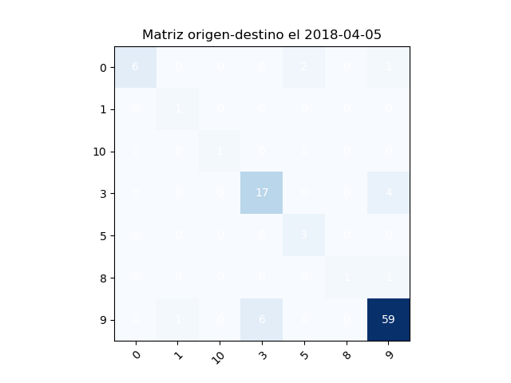
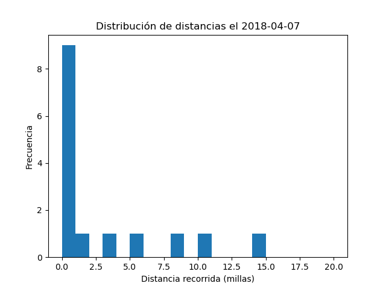

# Transportation Data Analysis Project

This project aims to analyze transportation data by determining the origin-destination matrix of trips and showcasing relevant statistics to understand mobility patterns.

## Requirements

- Python 3.7 or higher
- The pandas, matplotlib.

## Environment Setup

1. Clone the repository to your local machine: `git clone https://github.com/yeltsinvc/OpenAITransportation`
2. Navigate to the project directory: `cd OpenAITransportation/mobility_data_analysis/shared_mobility`
3. Add `Shared_Micromobility_Vehicle_Trips.csv` in data folder

## Data
Data can be download from https://data.austintexas.gov/Transportation-and-Mobility/Shared-Micromobility-Vehicle-Trips/7d8e-dm7r

## Usage

1. Run the `main.py` script to generate the origin-destination matrix and distance charts.
2. The images will be saved in the 'Results' and 'Distance' folders, respectively.

## Usage
1. Matrix OD by day

2. Distance diagram by day

## Contributing

1. Clone the repository to your local machine: `git clone https://github.com/username/openai-transportation.git`
2. Create a new branch for your contribution: `git checkout -b new-feature`
3. Make the necessary changes and commit your changes: `git commit -am "Add new feature"`
4. Push your changes to the repository: `git push origin new-feature`
5. Create a pull request on GitHub.

## Contact

If you have any questions or would like to contribute to this project, please contact us at ylvaleroc@gmail.com.

## License

This project is licensed under the MIT License - see the [LICENSE](LICENSE) file for details.